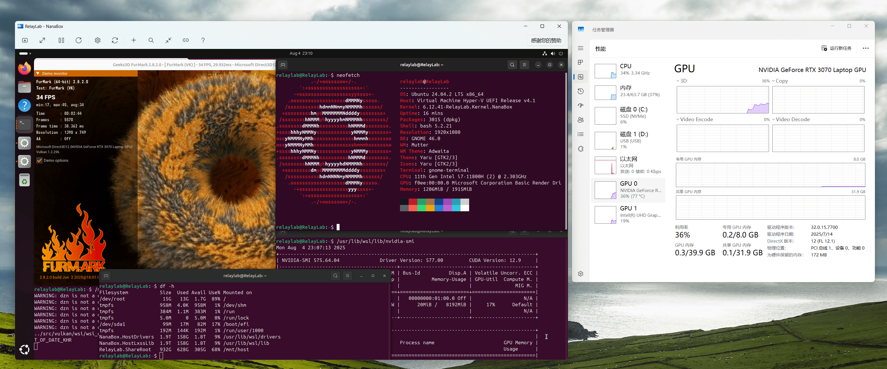

#  NanaBox

NanaBox is a third-party lightweight XAML-based out-of-box-experience oriented
Hyper-V virtualization software based on Host Compute System API, Remote Desktop
ActiveX control, and XAML Islands.

NanaBox is not a Hyper-V client because Host Compute System API is a low-level API
of Hyper-V WMI Providers which is used in Hyper-V Manager, and Host Compute System
API is stateless which is not available to manage virtual machines listed in
Hyper-V Manager.

NanaBox chooses Host Compute System API instead of Hyper-V WMI Providers because
the author (Kenji Mouri) wants to have portable virtual machine configurations
and finds the process of registering virtual machine configurations into the system
disgusting.

NanaBox chooses to define its own JSON-based virtual machine configurations format
because Hyper-V's VMCX is a binary format with no documented format definitions
from Microsoft.

**All kinds of contributions are appreciated. All suggestions, pull 
requests, and issues are welcome.**

If you want to sponsor the development of NanaBox, please read the document about
[NanaBox Sponsor Edition](Documents/SponsorEdition.md). It's free for all
NanaBox source code repository contributors.

In general, NanaBox Sponsor Edition is more like a contributors' edition, but
we provide a way to purchase the honor and make someone appear as a source code
contributor, because NanaBox is always a community-friendly open-source project.

If you'd like me to add features or improvements ahead of time, please use
[paid services](https://github.com/MouriNaruto/MouriNaruto/blob/main/PaidServices.md).

## Features

- Based on Host Compute System API as virtualization backend.
- Supports Hyper-V Enhanced Session Mode for Windows Guests.
- Supports Hyper-V Nested Virtualization.
- Supports Hyper-V GPU paravirtualization solution (a.k.a GPU-PV).
- Supports exposing COM ports and physical drives to the virtual machine.
- Supports enabling Secure Boot for virtual machines.
- Uses JSON-based format to support portable virtual machines.
- Packaged with MSIX for modern deployment experience.
- Modernizes the UI with XAML Islands including dark and light mode support.
- Full High DPI and partial Accessibility support.
- Supports full screen mode.
- Multi-language Support: English and Simplified Chinese.
- Enables the relative mouse mode in Windows 11 Version 24H2 or later Host OS.
- Supports the Trusted Platform Module (TPM) 2.0 for virtual machines in Windows
  11 Version 24H2 or later Host OS. (Although Windows Server 2022 introduced
  the related Host Compute System API interfaces, it seems they are not implemented.)
- Supports customizing partial System Management BIOS (SMBIOS) information for
  virtual machines.
- Supports cursor confinement with Ctrl+Alt+Left/Right shortcut key to improve
  user experience for some applications. (Press the same shortcut key to release
  cursor confinement.)
- Supports Plan 9 protocol over Hyper-V Socket for both read-only and read/write
  file sharing between host and guest.

## System Requirements

- Supported Operating Systems:
  - Windows 10, version 2004 (Build 19041) or later
  - Windows Server 2022 (Build 20348) or later
- Supported Platforms:
  - x86 (64-bit)
  - ARM (64-bit)

In general, NanaBox follows the 2025 baseline defined by Kenji Mouri's document,
read [MD23: The baselines of Windows targets for all my open-source projects]
for more information.

[MD23: The baselines of Windows targets for all my open-source projects]: https://github.com/MouriNaruto/MouriDocs/tree/main/docs/23

## Known issues

- Due to Host Compute System API and Host Compute Network API limitations, 
  there are some limitations from them that also apply to NanaBox:
  - NanaBox only supports creating UEFI Class 3 or UEFI without CSM or Hyper-V 
    Gen 2 virtual machines.
  - NanaBox needs elevated privilege via UAC.
  - The automatic switch between Enhanced Session Mode and Basic Session Mode
    won't be implemented.
  - You shouldn't put your virtual machine configuration file at the root of
    the drive, or you will encounter an access denied error.
- Due to the Microsoft Store Licensing API implementation, you will find that NanaBox
  will try to access the Internet starting with NanaBox 1.2 because NanaBox
  needs to use it to check the Sponsor Edition addon licensing status.
- To optimize the user experience, NanaBox will only check the Sponsor 
  Edition addon licensing status the first time you launch NanaBox. You
  can click the sponsor button to refresh the status after you
  have purchased or redeemed the Sponsor Edition addon.

Reference documents for known issues:

- [MD4: Notes for using Host Compute System API](https://github.com/MouriNaruto/MouriDocs/tree/main/docs/4)

## Tips for users who want to only enable Virtual Machine Platform feature

You need to execute the [GenerateVmmsCertificate.ps1](Documents/GenerateVmmsCertificate.ps1)
script (or from your binary packages) when using NanaBox for the first time or after
modifying your computer name.

> PowerShell -NoLogo -NoProfile -NonInteractive -InputFormat None -ExecutionPolicy Bypass "The path of the GenerateVmmsCertificate.ps1"

Also, you are unable to enable TPM support when using NanaBox with the Virtual
Machine Platform feature only.

## Development Roadmap

- Future Series (T.B.D.)
  - [ ] Add friendly virtual machine creation UI and settings UI.
  - [ ] Provide tool for Hyper-V vmcx migration. (Suggested by Belleve.)
  - [ ] Add support for setting RDP options with .rdp file. (Suggested by 
        awakecoding.)
  - [ ] Add support for connecting virtual machine with MsRdpEx from 
        Devolutions. (Suggested by awakecoding.)

## Documents

- [License](License.md)
- [Relevant People](Documents/People.md)
- [Privacy Policy](Documents/Privacy.md)
- [Code of Conduct](CODE_OF_CONDUCT.md)
- [Contributing Guide](CONTRIBUTING.md)
- [Release Notes](Documents/ReleaseNotes.md)
- [Versioning](Documents/Versioning.md)
- [NanaBox Configuration File Reference](Documents/ConfigurationReference.md)
- [NanaBox Sponsor Edition](Documents/SponsorEdition.md)
- [My Digital Life Forums](https://forums.mydigitallife.net/threads/88560)
