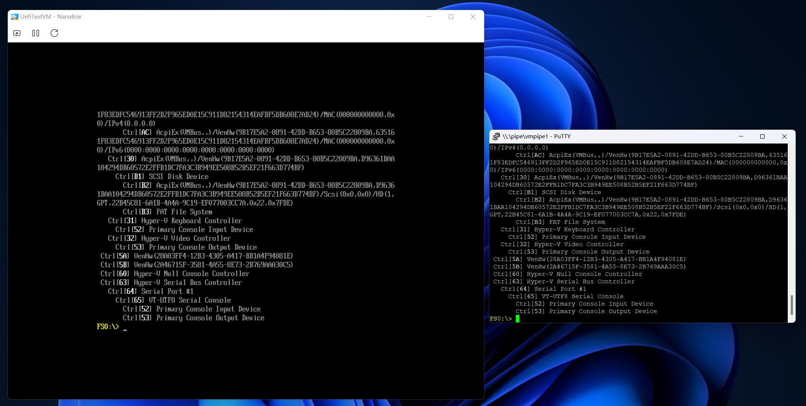
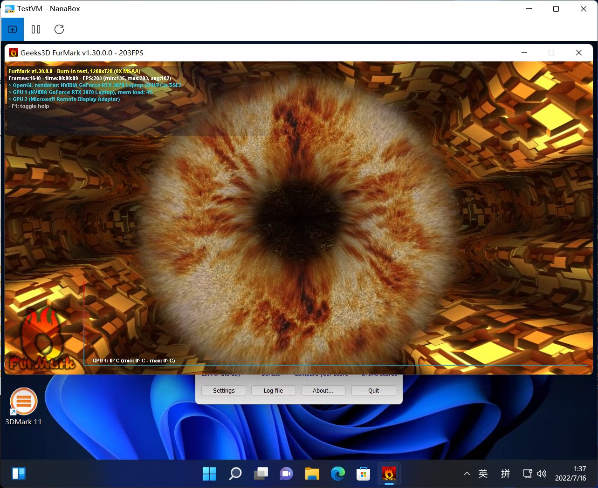
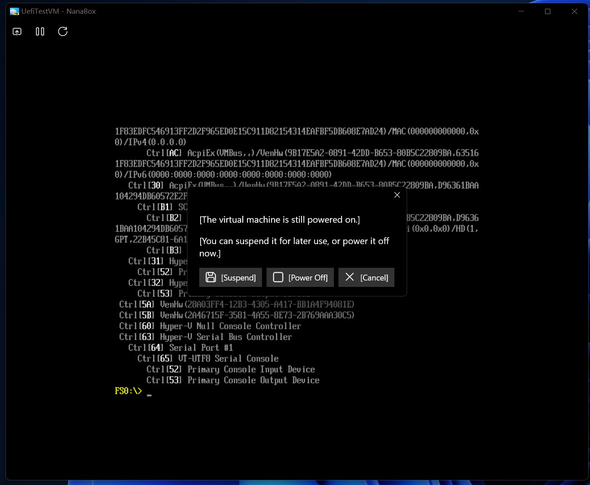

#  NanaBox

NanaBox is a third-party lightweight XAML-based out-of-box-experience oriented
Hyper-V client based on Host Compute System API, Remote Desktop ActiveX control
and XAML Islands.

**All kinds of contributions will be appreciated. All suggestions, pull 
requests and issues are welcome.**

## Features

- Based on Host Compute System API as virtualization backend.
- Support Hyper-V Enhanced Session Mode for Windows Guests.
- Support Hyper-V GPU paravirtualization solution a.k.a GPU-PV.
- Support expose COM ports and physical drives to the virtual machine.
- Support enable Secure Boot for virtual machine.
- Use JSON based format to support portable virtual machine.
- Packaging with MSIX for modern deployment experience.
- Modernize the UI with XAML Islands with dark and light mode support. (Dynamic
  dark and light mode switching is supported for Windows 11 and later.)
- Full High DPI and partial Accessibility support.

## System Requirements

- Supported OS: Windows 10 Version 2004 (Build 19041) or later
- Supported Platforms: x64 and ARM64

## Known issues

- The localization for the NanaBox UI is not implemented in NanaBox 1.0 Preview
  1.
- The virtual machine creation UI and settings UI is not implemented in NanaBox
  1.0 Preview 1.
- The automatic switch between Enhanced Session Mode and Basic Session Mode is 
  not implemented because HcsEventSystemRdpEnhancedModeStateChanged event can 
  be fired on at least Windows 10 Build 17763, but in Windows 11 Build 22621 
  cannot. It's confirmed as a HCS API bug via a friendly Microsoft employee 
  and will fix it in the future.
- TPM support is not available because current stage of HCS API seems doesn't 
  implement them.
- NanaBox needs elevated privilege via UAC because HCN API in Windows 11 Build
  22621 will return ERROR_ACCESS_DENIED even add the current user to the Hyper-V
  Administrators user group. Windows 10 don't have that issue.

## Development Roadmap

- 1.x Series (Late 2022)
  - [x] Based on Host Compute System API as virtualization backend.
  - [x] Add Hyper-V Enhanced Session Mode support for Windows Guests.
  - [x] Add Hyper-V GPU paravirtualization solution a.k.a GPU-PV support.
  - [x] Add expose COM ports and physical drives to the virtual machine support.
  - [x] Add enable Secure Boot for virtual machine support.
  - [x] Add JSON based format to support portable virtual machine.
  - [x] Packaging with MSIX for modern deployment experience.
  - [x] Modernize the UI with XAML Islands with dark and light mode support. 
        (Dynamic dark and light mode switching is supported for Windows 11 and 
        later.)
  - [x] Add full High DPI and partial Accessibility support.
  - [ ] Add localization for the NanaBox UI.
  - [ ] Add virtual machine creation UI and settings UI.
  - [ ] Submit to the Windows Store.
- Future Series (T.B.D.)
  - Currently no new feature plans for this series.

## Documents

- [License](License.md)
- [Relevant People](Documents/People.md)
- [Privacy Policy](Documents/Privacy.md)
- [Code of Conduct](CODE_OF_CONDUCT.md)
- [Contributing Guide](CONTRIBUTING.md)
- [Release Notes](Documents/ReleaseNotes.md)
- [Versioning](Documents/Versioning.md)
