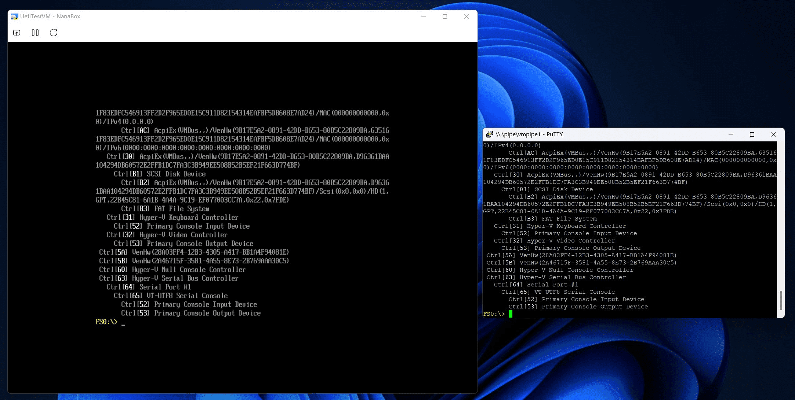
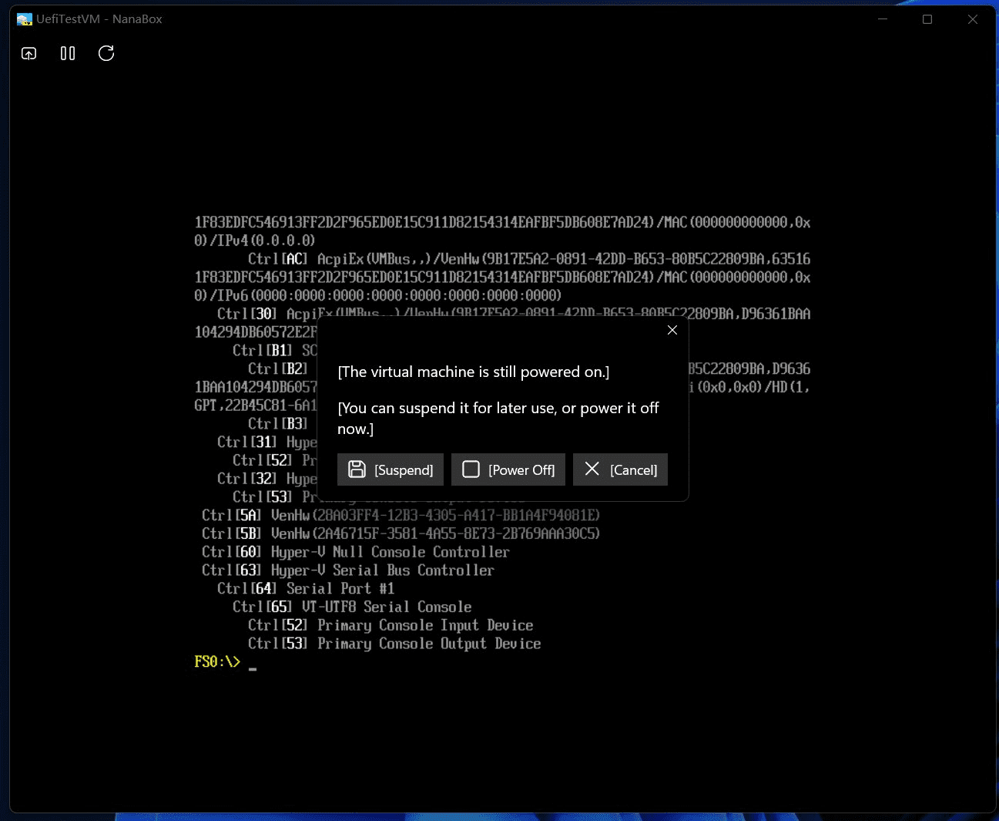

#  NanaBox

NanaBox is a third-party lightweight XAML-based out-of-box-experience oriented
Hyper-V virtualization software based on Host Compute System API, Remote Desktop
ActiveX control and XAML Islands.

NanaBox is not a Hyper-V client because Host Compute System API is low-level API
of Hyper-V WMI Providers which used in Hyper-V Manager, and Host Compute System
API is stateless which not available to manage virtual machines listed in
Hyper-V Manager.

NanaBox chooses Host Compute System API instead of Hyper-V WMI Providers because
the author (Kenji Mouri) wants to have portable virtual machine configurations
and feels disgusting for registering virtual machine configurations into system.

NanaBox chooses define own JSON-based virtual machine configurations format
because Hyper-V's VMCX is a binary format and no documented format definitions
from Microsoft.

**All kinds of contributions will be appreciated. All suggestions, pull 
requests, and issues are welcome.**

If you want to sponsor the development of NanaBox, please read the document of
[NanaBox Sponsor Edition](Documents/SponsorEdition.md). It's free for all
NanaBox source code repository contributors.

In general, NanaBox Sponsor Edition is more like contributor's edition, but
we provide a way to buy the honor and make someone look like a source code
contributor, because NanaBox is always a community-friendly open-source project.

If you'd like me to add features or improvements ahead of time, please use
[paid services](https://github.com/MouriNaruto/MouriNaruto/blob/main/PaidServices.md).

## Features

- Based on Host Compute System API as virtualization backend.
- Support Hyper-V Enhanced Session Mode for Windows Guests.
- Support Hyper-V Nested Virtualization.
- Support Hyper-V GPU paravirtualization solution a.k.a GPU-PV.
- Support expose COM ports and physical drives to the virtual machine.
- Support enables Secure Boot for virtual machine.
- Use JSON based format to support portable virtual machine.
- Packaging with MSIX for modern deployment experience.
- Modernize the UI with XAML Islands with dark and light mode support.
- Full High DPI and partial Accessibility support.
- Support full screen mode.
- Multi-language Support: English and Simplified Chinese.
- Enable the relative mouse mode in Windows 11 Version 24H2 or later Host OS.
- Support the Trusted Platform Module (TPM) 2.0 for virtual machines in Windows
  Server 2022 or later Host OS. (Tested under Windows 11 Version 24H2.)

## System Requirements

- Supported OS: Windows 10 Version 2004 (Build 19041) or later
- Supported Platforms: x64 and ARM64

## Known issues

- Due to Host Compute System API and Host Compute Network API limitations, 
  there are some limitations from them also applied to NanaBox:
  - NanaBox only supports create UEFI Class 3 or UEFI without CSM or Hyper-V 
    Gen 2 virtual machines.
  - NanaBox needs elevated privilege via UAC.
  - The automatic switch between Enhanced Session Mode and Basic Session Mode
    won't be implemented.
  - You shouldn't put your virtual machine configuration file at the root of
    the drive, or you will meet the access denied error.
- Due to the Microsoft Store Licensing API implementation, you will find NanaBox
  will try to access the Internet beginning with NanaBox 1.2 because NanaBox
  needs to use that to check the Sponsor Edition addon licensing status.
- For optimizing the user experience, NanaBox will only check the Sponsor 
  Edition addon licensing status at the first time your launch NanaBox. You
  can click the sponsor button if you want to refresh the status after you
  have purchased or redeemed the Sponsor Edition addon.

Reference documents for known issues:

- [MD4: Notes for using Host Compute System API](https://github.com/MouriNaruto/MouriDocs/tree/main/docs/4)

## Development Roadmap

- Future Series (T.B.D.)
  - [ ] Add friendly virtual machine creation UI and settings UI.
  - [ ] Provide tool for Hyper-V vmcx migration. (Suggested by Belleve.)
  - [ ] Add support for setting RDP options with .rdp file. (Suggested by 
        awakecoding.)
  - [ ] Add support for connecting virtual machine with MsRdpEx from 
        Devolutions. (Suggested by awakecoding.)

## Documents

- [License](License.md)
- [Relevant People](Documents/People.md)
- [Privacy Policy](Documents/Privacy.md)
- [Code of Conduct](CODE_OF_CONDUCT.md)
- [Contributing Guide](CONTRIBUTING.md)
- [Release Notes](Documents/ReleaseNotes.md)
- [Versioning](Documents/Versioning.md)
- [NanaBox Configuration File Reference](Documents/ConfigurationReference.md)
- [NanaBox Sponsor Edition](Documents/SponsorEdition.md)
